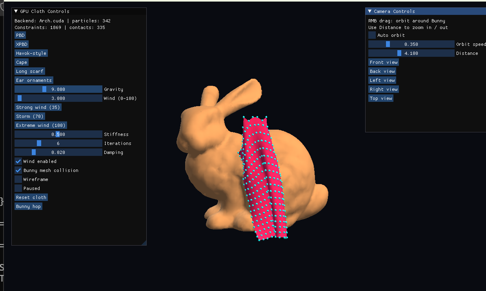
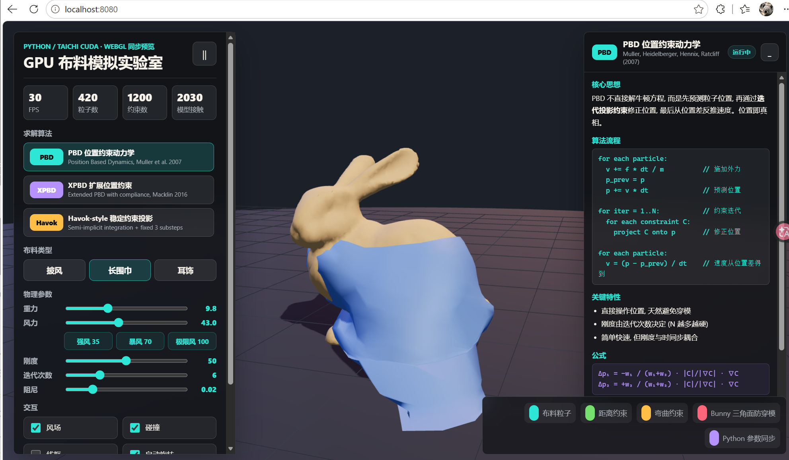

# GPU Cloth Simulation（Python / Taichi）

## 演示效果


[▶ 查看完整 MP4 演示](./picture/bandicam%202026-08-14%2009-58-16-399.mp4)

基于 Python 与 Taichi CUDA 的实时布料物理演示。粒子积分、PBD/XPBD 约束、
Havok-style 子步进以及 Stanford Bunny 三角网格碰撞均在 GPU kernel 中执行；
Python 负责 PLY 加载、拓扑生成和交互控制。

## 当前实现

- **PBD**：Jacobi 并行位置约束投影。
- **XPBD**：带 compliance 和累计 Lagrange 乘子的并行求解。
- **Havok-style**：半隐式积分、固定三子步和稳定约束投影的教学近似。
- **披风**：18 × 19 网格，Python 版本固定在兔子头部前方。
- **长围巾**：21 环、420 粒子，有效长度约 1.4 场景单位。
- **耳饰**：8 束 GPU 链式粒子。
- **真实模型碰撞**：CPU 启动阶段把 Bunny 的 16,301 个三角面组织成均匀空间网格；
  GPU 每帧仅查询粒子邻近单元中的真实三角面。
- **保守防穿模**：0.022 场景单位安全厚度、单步位移限制、至少双物理子步、
  约束后最终碰撞投影，并将固定挂点持久吸附到模型外侧。
- **GPU 主程序**：Taichi GGUI 直接渲染 GPU 字段。
- **网页同步预览**：旧网页已同步当前 Python 版本的布料尺寸、固定点、风力范围、
  子步策略和防穿模参数，方便通过浏览器展示；网页渲染使用 WebGL，GPU 主程序仍使用 CUDA。

## 环境要求

- Windows 10/11 x64
- Python 3.12 x64
- NVIDIA GPU 与可用 CUDA 驱动（当前机器已验证 RTX 4090）

## 一键启动与测试



启动 Python/CUDA 模拟直接双击：

```text
start_gpu.bat
```

脚本会自动完成以下操作：

1. 定位 Python 3.12，首次运行时创建 `.venv`。
2. 检查并自动安装 Taichi 1.7.4 与 NumPy 1.26.4。
3. 检查 NVIDIA GPU/CUDA 驱动。
4. 执行 30 步 CUDA 防穿模冒烟测试。
5. 测试通过后启动 GPU 实时窗口。

网页端展示：



```bat
start_server.bat
```

启动网页模拟直接双击 `start_server.bat`，浏览器会自动打开 `http://localhost:8080`。
关闭服务器窗口或按 `Ctrl+C` 即可停止网页服务。

## 操作

- Python 窗口按住鼠标右键拖动：围绕兔子自由旋转相机。
- `Camera Controls`：前、后、左、右、顶部视角，自动环绕、环绕速度和观察距离。
- 控制面板：切换 PBD、XPBD、Havok-style。
- 切换 Cape、Long scarf、Ear ornaments。
- 调整重力、风力、刚度、迭代次数和阻尼。风力范围为 0–100（原范围的 5 倍），并提供强风 35、暴风 70、极限风 100 三个快捷预设。
- 开关 Bunny 真实网格碰撞、线框、暂停。
- `Bunny hop`：测试运动角色挂点和碰撞跟随。

## 命令行验证

无窗口 CUDA 回归：

```powershell
.\.venv\Scripts\python.exe .\gpu_cloth_demo.py --headless --steps 120
```

指定算法和布料：

```powershell
.\.venv\Scripts\python.exe .\gpu_cloth_demo.py --headless --algorithm xpbd --cloth scarf
```

可用参数：

- `--arch cuda|vulkan|cpu`
- `--algorithm pbd|xpbd|havok`
- `--cloth cape|scarf|hair`
- `--wind 0..100`
- `--headless --steps N`

## 项目结构

```text
cloth-simulation-demo/
├── gpu_cloth_demo.py   # Python/Taichi GPU 主程序
├── bunny.ply           # Stanford Bunny 三角模型
├── requirements.txt    # 锁定的 Python 依赖
├── start_gpu.bat       # Python/CUDA 模拟唯一启动入口
├── start_server.bat    # 网页模拟唯一启动入口
├── index.html          # Python 效果同步展示页
├── styles.css          # 网页展示样式
└── src/main.js         # WebGL 同步物理预览
```

## 实测结果（RTX 4090）

120 步 CUDA 无窗口回归，包含首次 JIT 编译：

| 模式 | 粒子 | 约束 | 实际模型接触 | 模拟速度 |
|---|---:|---:|---:|---:|
| PBD 披风 | 342 | 1,869 | 132 | 54.1 FPS |
| XPBD 披风 | 342 | 1,869 | 80 | 52.5 FPS |
| Havok-style 披风 | 342 | 1,869 | 90 | 58.4 FPS |
| PBD 长围巾 | 420 | 1,200 | 1,379 | 38.3 FPS |

Taichi 1.7.4 在 Windows/Python 3.12 上存在原生解释器析构异常，主入口在所有
kernel 完成后使用明确退出码绕过该第三方析构路径；运行期异常仍会打印并返回 1。

Taichi 的 CUDA 与 GGUI 用法依据其官方文档实现：
https://docs.taichi-lang.org/docs/ggui
